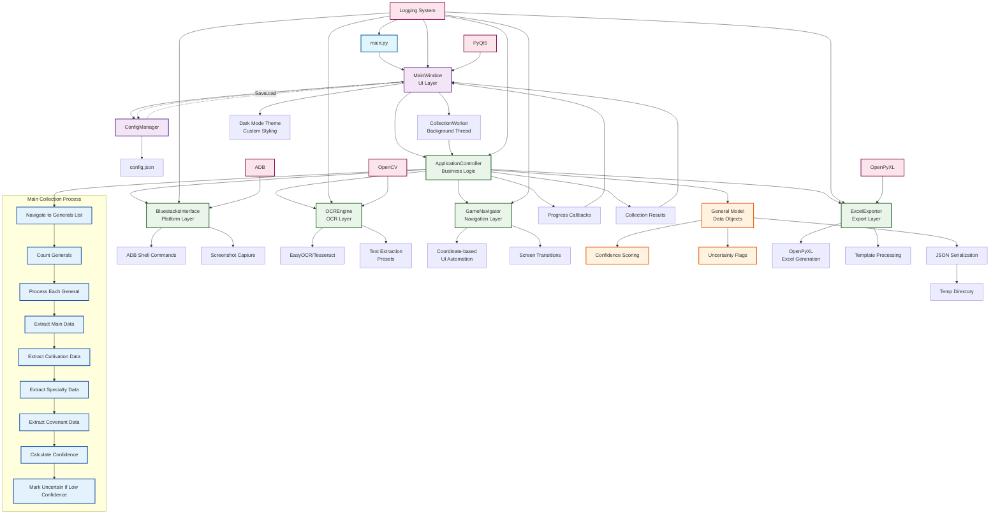

# Evony Active Generals Tracker - Module Interaction Flow

## Module Interaction Overview

### **Entry Point Layer**
- **`main.py`**: Application bootstrap, logging setup, Qt application initialization

### **UI Layer**
- **`MainWindow`**: PyQt5-based GUI with dark mode theming
- **`ConfigManager`**: JSON-based configuration management with defaults
- **Threading**: `CollectionWorker` handles background data collection

### **Controller Layer**
- **`ApplicationController`**: Main orchestration logic, coordinates all components
- **Initialization**: Sets up platform, OCR, navigation, and export components
- **Progress Tracking**: Manages callbacks and status updates

### **Platform Layer**
- **`BluestacksInterface`**: ADB-based device communication
- **Screenshot Capture**: Device screen capture for OCR processing
- **Connection Management**: Device connectivity and session handling

### **OCR Layer**
- **`OCREngine`**: Text extraction from game screenshots
- **Preset-based Extraction**: Uses coordinate presets for different data types
- **Confidence Scoring**: Quality assessment for extracted data

### **Navigation Layer**
- **`GameNavigator`**: UI automation within the Evony game
- **Coordinate Navigation**: Tap coordinates for menu navigation
- **Screen Transitions**: Handles delays and state changes

### **Data Layer**
- **`General Model`**: Dataclass representing general information
- **Confidence Tracking**: Per-field confidence scores
- **Uncertainty Flags**: Marks low-confidence extractions

### **Export Layer**
- **`ExcelExporter`**: Spreadsheet generation using OpenPyXL
- **Template Processing**: Uses Excel template for formatting
- **Data Formatting**: Converts model data to spreadsheet format

### **Key Data Flows**

1. **Configuration Flow**: `main.py` → `ConfigManager` → `MainWindow` → `ApplicationController`
2. **Collection Flow**: `MainWindow` → `CollectionWorker` → `ApplicationController` → Platform/OCR/Navigation
3. **Data Flow**: OCR/Navigation → `General` models → `ExcelExporter`
4. **Feedback Flow**: `ApplicationController` → Progress Callbacks → `MainWindow` UI updates

### **External Dependencies**
- **PyQt5**: GUI framework
- **OpenCV**: Image processing for OCR
- **ADB**: Android device communication
- **OpenPyXL**: Excel file manipulation
- **EasyOCR/Tesseract**: OCR engines

### **Process Flow Details**

The main collection process follows this sequence:
1. Navigate to generals list screen
2. Count total available generals
3. For each general:
   - Open general details
   - Capture and extract main data (name, level, type, power, exp)
   - Navigate to cultivation screen and extract stats
   - Navigate to specialties screen and extract abilities
   - Navigate to covenant screen and extract linked generals
   - Calculate overall confidence score
   - Mark as uncertain if confidence below threshold
4. Export collected data to Excel format

### **Error Handling & Recovery**
- Platform connection failures → User notification
- OCR extraction failures → Uncertainty flags
- Navigation timeouts → Retry logic with configurable attempts
- Thread interruption → Graceful collection stopping

### **Configuration Management**
- JSON-based configuration with sensible defaults
- Runtime configuration updates saved automatically
- Debug mode for enhanced logging
- Platform-specific settings (ADB paths, device IDs)