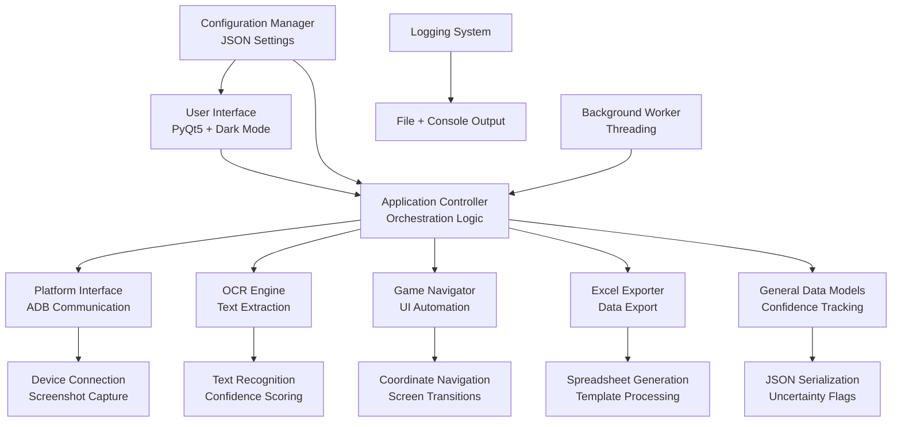
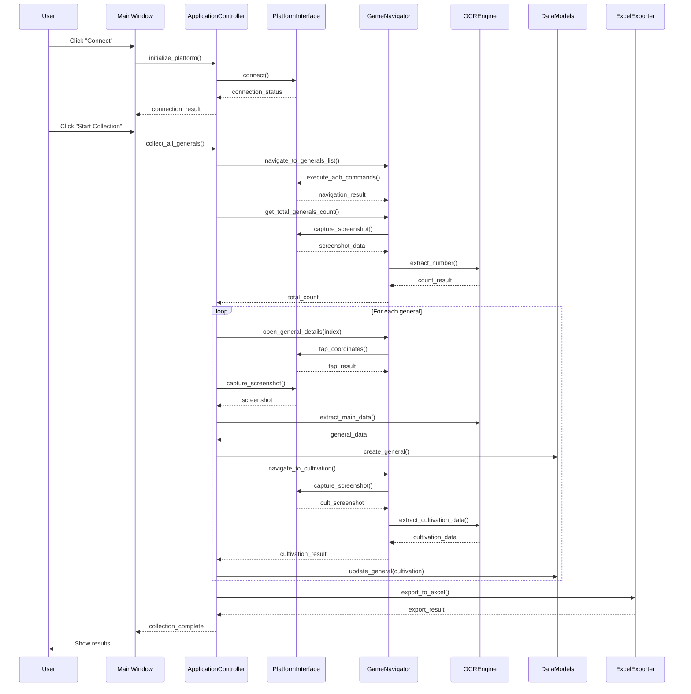
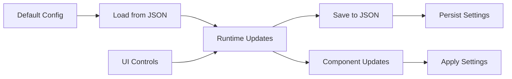

# Evony Active Generals Tracker - Architecture Overview

## High-Level Architecture



## Component Responsibilities

### 🎯 **Main Entry Point** (`main.py`)
- Application bootstrap and Qt initialization
- Logging configuration setup
- High-DPI scaling support

### 🖥️ **User Interface** (`ui/main_window.py`)
- PyQt5-based GUI with custom dark theming
- Configuration management interface
- Progress tracking and status display
- Background thread coordination

### ⚙️ **Application Controller** (`controllers/application_controller.py`)
- **Central orchestration hub** coordinating all components
- Platform initialization and lifecycle management
- Data collection workflow management
- Progress callback handling and error recovery

### 🔧 **Platform Interface** (`platform_adb/bluestacks_interface.py`)
- ADB shell command execution
- Device connectivity management
- Screenshot capture from game device
- Connection state monitoring

### 👁️ **OCR Engine** (`ocr/ocr_engine.py`)
- Text extraction from game screenshots
- Multiple OCR engine support (EasyOCR/Tesseract)
- Coordinate-based text region detection
- Confidence scoring for data quality

### 🧭 **Game Navigator** (`navigation/game_navigator.py`)
- In-game UI automation using coordinates
- Screen transition management with delays
- Navigation state validation
- Retry logic for failed operations

### 📊 **Data Models** (`models/general.py`)
- General information data structures
- Confidence score tracking per field
- Uncertainty flag management
- JSON serialization support

### 📈 **Excel Exporter** (`export/excel_exporter.py`)
- Spreadsheet generation using OpenPyXL
- Template-based formatting
- Image embedding for specialties/covenants
- Auto-open functionality

### 🔧 **Configuration Manager** (`config/config_manager.py`)
- JSON-based settings management
- Default configuration handling
- Runtime configuration updates
- Settings persistence

## Data Flow Sequence



## Key Interaction Patterns

### **Initialization Pattern**
```
ConfigManager → MainWindow → ApplicationController → [Platform, OCR, Navigator, Exporter]
```

### **Collection Pattern**
```
MainWindow → CollectionWorker → ApplicationController → GameNavigator → PlatformInterface
                                                            ↓
                                                     OCREngine → DataModels
```

### **Export Pattern**
```
MainWindow → ApplicationController → ExcelExporter → OpenPyXL → Excel File
```

### **Feedback Pattern**
```
ApplicationController → Progress Callbacks → MainWindow → UI Updates
```

## Error Handling Strategy

- **Platform Errors**: Connection failures → User notification with retry options
- **OCR Errors**: Low confidence → Uncertainty flags on data
- **Navigation Errors**: Timeout/retry logic with configurable attempts
- **Threading Errors**: Graceful interruption and cleanup
- **Export Errors**: Fallback to basic export without advanced formatting

## Configuration Flow



This architecture provides a clean separation of concerns with the ApplicationController serving as the central coordination point, ensuring maintainable and testable code structure.