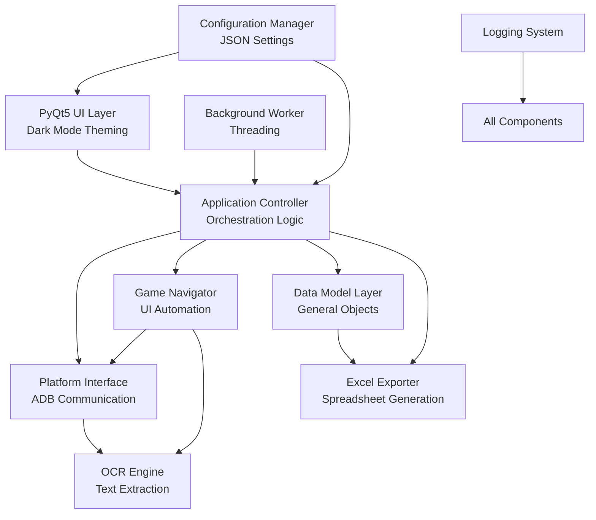

# Design Document

## Overview

The Evony Active Generals Tracker is a Python application that automates the extraction of general information from the Evony MMO game and exports it to Excel. The application uses PyQt5 for the UI, OCR for text extraction, and platform-specific interfaces (ADB for Android/Bluestacks) to interact with the game.

The system follows a modular architecture with clear separation between platform interaction, data extraction, UI, and export functionality, but is designed for simplicity and maintainability.

## Architecture

For detailed architecture documentation, see:
- **[Architecture Flow Diagram](architecture_flow.md)**: Comprehensive Mermaid diagrams showing all module interactions and data flows
- **[Architecture Overview](architecture_overview.md)**: High-level component descriptions with sequence diagrams
- **[Simple Architecture](simple_architecture.md)**: Quick-reference ASCII diagram for presentations

### High-Level Architecture Overview



### Architecture Layers

1. **UI Layer (PyQt5)**: Cross-platform interface for user interaction
2. **Application Controller**: Orchestrates the data collection workflow
3. **Platform Interface Layer**: Abstracts platform-specific communication (ADB, future iOS, future Android)
4. **OCR Engine**: Handles image preprocessing and text extraction
5. **Game Navigator**: Automates navigation through game screens
6. **Data Model Layer**: Stores and manages extracted general data
7. **Excel Exporter**: Generates formatted Excel spreadsheets

## Components and Interfaces

### 1. Platform Interface Layer

**Purpose**: Provide unified interface for interacting with different platforms

**Components**:
- `PlatformInterface` (Abstract Base Class)
- `BluestacksInterface` (Windows via ADB)
- future `AndroidInterface` (Native Android via ADB)
- future `IOSInterface` (iOS via platform-specific bridge)

**Key Methods**:
```python
class PlatformInterface(ABC):
    @abstractmethod
    def connect() -> bool
    
    @abstractmethod
    def capture_screenshot() -> Image
    
    @abstractmethod
    def send_tap(x: int, y: int) -> bool
    
    @abstractmethod
    def send_swipe(x1: int, y1: int, x2: int, y2: int, duration: int) -> bool
    
    @abstractmethod
    def is_connected() -> bool
    
    @abstractmethod
    def disconnect() -> None
```

**Design Decisions**:
- Use ADB for both Bluestacks and Android devices (consistent interface)
- iOS will require platform-specific implementation (possibly using pymobiledevice3 or similar)
- All coordinates are normalized (0-1 range) to handle different screen resolutions and will be converted to actual coordinates by the platform interface

### 2. OCR Engine

**Purpose**: Extract text from game screenshots with varied backgrounds using a line concept where all text within an image is extracted and then filtered by the line concept

**Components**:
- `OCREngine`: Main OCR coordinator
- `ImagePreprocessor`: Enhances images for better OCR accuracy
- `TextExtractor`: Wraps OCR library (Tesseract via pytesseract or EasyOCR)

**Key Methods**:
```python
class OCREngine:
    def extract_text(image: Image, region: Region = None) -> OCRResult
    def extract_number(image: Image, region: Region = None) -> int
    def preprocess_image(image: Image) -> Image
    def get_confidence() -> float
```

**Image Preprocessing Pipeline**:
1. Convert to grayscale
2. Apply adaptive thresholding
3. Denoise (bilateral filter)
4. Contrast enhancement
5. Optional: Background removal for specific regions

**Design Decisions**:
- Use EasyOCR as primary engine (better with varied backgrounds)
- Fall back to Tesseract for specific numeric fields
- Confidence threshold of 80% triggers uncertainty flag
- Cache preprocessed images for debugging

### 3. Game Navigator

**Purpose**: Automate navigation through Evony's interface to collect general data

**Components**:
- `GameNavigator`: Main navigation controller
- `NavigationPath`: Defines sequences of actions to reach target screens

**Key Methods**:
```python
class GameNavigator:
    def navigate_to_generals_list() -> bool
    def open_general_details(general_index: int) -> bool
    def close_general_details() -> bool
    def scroll_generals_list(direction: str) -> bool
    def wait_for_screen_load(expected_screen: str, timeout: int) -> bool
    def detect_current_screen() -> str
```

**Image Detection Strategy**:
- In some instances, the application will need to Use template matching for image snippets to determine their on/off state, and stored for state restore at the end of the process


**Design Decisions**:
- Implement wait-and-verify pattern (action → wait → verify)
- Use configurable delays for screen transitions (default 1-2 seconds)
- Retry mechanism for failed navigation (max 3 attempts)
- Screenshot-based verification after each navigation step to verify screen change has happened and is different from the previous screen

### 4. Data Model Layer

**Purpose**: Store and manage extracted general data

**Components**:
- `General`: Data class representing a single general
- `GeneralRepository`: Collection of all generals
- `DataValidator`: Validates extracted data quality

**Data Structure**:
```python
@dataclass
class General:
    name: str
    level: int
    type: str
    power: int
    stars_image: Image
    exp_ratio: str
    specialty_images: List[Image]
    covenant_list: str
    covenant_generals: List[str]
    confidence_scores: Dict[str, float]
    is_uncertain: bool
```

**Design Decisions**:
- Store both text and images (stars, specialty icons)
- Track confidence scores per field
- Flag entire general as uncertain if any field < 80% confidence
- Support incremental updates (for real-time Excel export)
- **Incremental Excel saving**: Prevents data loss if collection is interrupted
- **Real-time UI updates**: Table refreshes after each general is processed

### 5. Excel Exporter

**Purpose**: Generate formatted Excel spreadsheets with general data

**Components**:
- `ExcelExporter`: Main export coordinator
- `ExcelFormatter`: Handles cell formatting and styling
- `ImageInserter`: Embeds images into cells

**Key Methods**:
```python
class ExcelExporter:
    def create_workbook(template_path: str = None) -> Workbook
    def clear_data_rows(workbook: Workbook) -> None
    def export_generals(generals: List[General], file_path: str) -> bool
    def format_cells(worksheet: Worksheet) -> None
    def insert_images(worksheet: Worksheet, generals: List[General]) -> None
```

**Formatting Rules**:
- Headers: Bold, centered, background color (rows 1-5 preserved from template)
- Text columns: Left-aligned, vertical center, text wrapping enabled for multi-line content
- Numeric columns: Right-aligned, comma formatting, vertical center
- Image columns: Centered, cell height adjusted to fit image
- All rows match height of image-containing cells
- **Data starts at row 6** to preserve template header structure

**Design Decisions**:
- Use openpyxl library for Excel manipulation
- Support template-based export (pre-formatted workbook)
- **Incremental export**: Update Excel file after each general to prevent data loss
- Always clear existing data before export (no refresh, full regeneration)
- Anchor images to cells to prevent shifting
- Enable text wrapping for multi-line cultivation, specialty, and covenant data

### 6. Application Controller

**Purpose**: Orchestrate the entire data collection and export workflow

**Key Methods**:
```python
class ApplicationController:
    def initialize_platform(platform_type: str) -> bool
    def collect_all_generals(progress_callback: Callable = None, export_path: str = None) -> List[General]
    def export_to_excel(file_path: str) -> bool
    def get_progress() -> ProgressInfo
```

**Workflow**:
1. Connect to platform
2. Navigate to generals list
3. Count total generals (for progress tracking)
4. **Create incremental Excel file** for real-time saving
5. For each general:
   - Open details screen
   - Capture screenshots
   - Extract data via OCR
   - Extract images
   - Store in data model
   - **Update Excel file incrementally** (prevents data loss on interruption)
   - **Update UI table in real-time** (shows live progress)
   - Update progress
6. **Final Excel export** (optional - data already saved incrementally)
7. Disconnect from platform

**Design Decisions**:
- Implement progress callbacks for UI updates
- Handle interruptions gracefully (save partial data)
- Log all actions for debugging
- Implement pause/resume functionality

### 7. PyQt5 UI Layer

**Purpose**: Provide cross-platform user interface

**Main Windows**:
- `MainWindow`: Primary application window
- `ConnectionDialog`: Platform selection and connection
- `ProgressDialog`: Shows collection progress
- `SettingsDialog`: Configuration options

**UI Components**:
- Platform selector (dropdown)
- Connect/Disconnect button
- Start collection button
- Progress bar with status text
- General list view (live updates)
- Export button with file picker
- Settings button

**Design Decisions**:
- Use Qt's signal/slot mechanism for async updates
- Run data collection in separate thread (QThread)
- Responsive UI during long operations
- Future: Adapt layout for mobile platforms (larger touch targets)

## Data Models

### General Data Model

```python
@dataclass
class General:
    # Core fields from main details screen
    name: str
    level: str
    type: str
    power: int
    exp_ratio: str
    stars_image: bytes
    
    # Concatenated data from subscreens (stored as CRLF-separated strings)
    cultivation_data: str  # "Leadership: 85+15\nAttack: 92+1\nDefense: 78+7\nPolitics: 81-3"
    specialty_data: str    # "'Specialty1 Icon'+' '+'Specialty1 Name'\n'Specialty2 Icon'+' '+'Specialty2 Name'\n..."
    covenant_data: str     # "'Covenant1 Icon'+' '+'Covenant1 Name'\n'Covenant2 Icon'+' '+'Covenant2 Name'\n..."
    
    # Metadata
    confidence_scores: Dict[str, float]
    is_uncertain: bool
    timestamp: datetime
    
    def to_dict(self) -> Dict
    def from_dict(data: Dict) -> 'General'
```

### Configuration Model

```python
@dataclass
class AppConfig:
    # Platform settings
    platform_type: str  # "bluestacks", "android", "ios"
    adb_path: str
    device_id: str
    
    # OCR settings
    ocr_engine: str  # "easyocr", "tesseract"
    confidence_threshold: float
    preprocessing_enabled: bool
    
    # Navigation settings
    screen_transition_delay: float
    navigation_retry_count: int
    
    # Export settings
    default_export_path: str
    excel_template_path: str
    
    def save_to_file(path: str) -> None
    def load_from_file(path: str) -> 'AppConfig'
```

## Error Handling

### Error Categories

1. **Connection Errors**
   - Platform not detected
   - ADB connection failed
   - Device disconnected during operation

2. **Navigation Errors**
   - Screen not found
   - Navigation timeout
   - Unexpected screen state

3. **OCR Errors**
   - Low confidence extraction
   - Unrecognized text format
   - Image capture failed

4. **Export Errors**
   - File write permission denied
   - Invalid template format
   - Image insertion failed

### Error Handling Strategy

- **Retry Logic**: Automatic retry for transient errors (max 3 attempts)
- **Graceful Degradation**: Continue with partial data if some fields fail
- **User Notification**: Clear error messages with troubleshooting steps
- **Logging**: Comprehensive logging for debugging (screenshots, OCR results, actions)
- **Recovery**: Save partial progress before critical operations

### Error Recovery Patterns

```python
class ErrorHandler:
    def handle_connection_error(error: Exception) -> RecoveryAction
    def handle_navigation_error(error: Exception) -> RecoveryAction
    def handle_ocr_error(error: Exception) -> RecoveryAction
    def log_error(error: Exception, context: Dict) -> None
```


### Core Libraries

- **PyQt5**: UI framework (cross-platform)
- **opencv-python**: Image processing
- **pytesseract** or **easyocr**: OCR engines
- **openpyxl**: Excel file manipulation
- **Pillow**: Image handling
- **pure-python-adb** or **adb-shell**: ADB communication
- **pymobiledevice3**: iOS device communication (if supporting iOS)

### Platform-Specific

- **Windows**: pywin32 (optional, for window management)
- Future: **Android**: None (ADB handles everything)
- Future:  **iOS**: libimobiledevice bindings

## Configuration Files

### config.json

```json
{
  "platform": {
    "type": "bluestacks",
    "adb_path": "C:\\Program Files\\BlueStacks\\HD-Adb.exe",
    "device_id": "127.0.0.1:5555"
  },
  "ocr": {
    "engine": "easyocr",
    "confidence_threshold": 0.8,
    "languages": ["en"]
  },
  "navigation": {
    "transition_delay": 1.5,
    "retry_count": 3,
    "screenshot_scale": 1.0
  },
  "export": {
    "default_path": "~/EvonyActiveGenerals.xlsx",
    "auto_open": true
  }
}
```

## Future Enhancements

1. **Advanced OCR**: Train custom model for Evony-specific fonts
2. **Scheduling**: Automatic periodic data collection
3. **Multi-Account**: Support multiple Evony accounts

